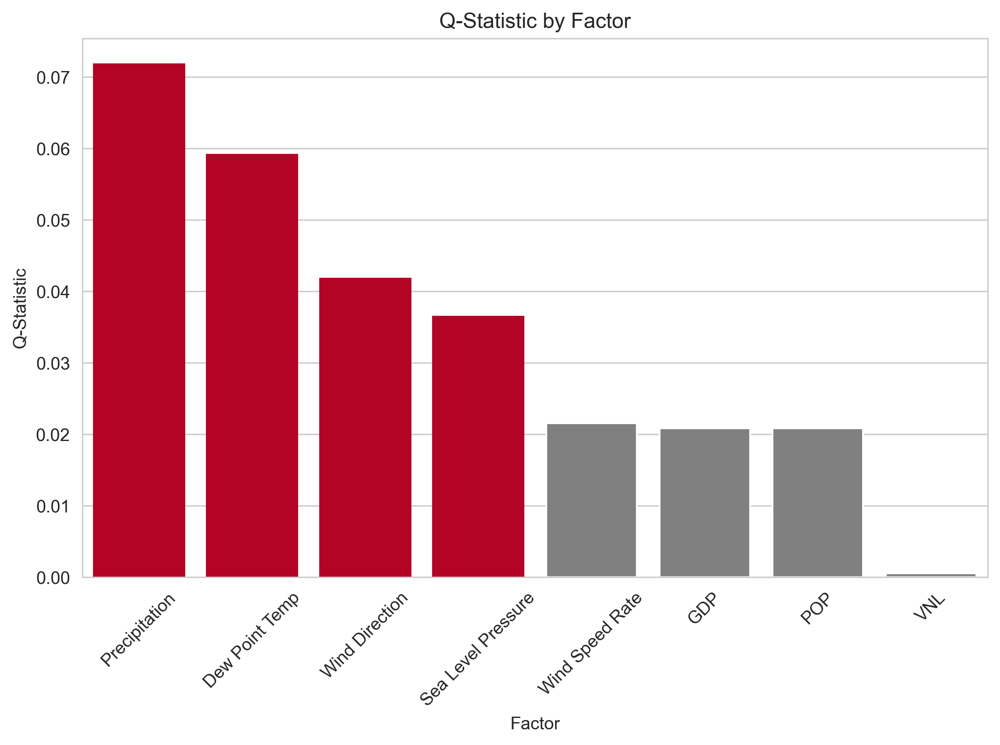
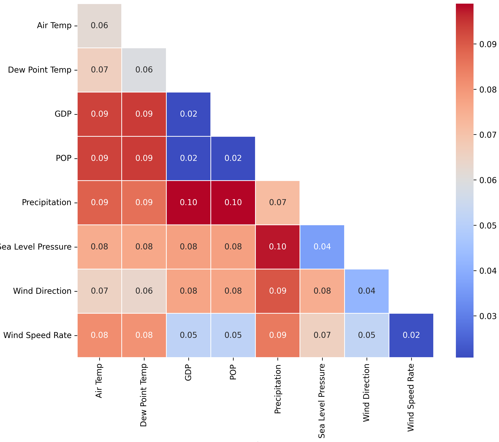

# Investigating the influencing factors of urban heat island effects: a case study of central China in 2015.
### [Video-Bilibili](https://www.bilibili.com/) | [Online-PPT](https://www.mdpi.com/journal/ijgi)
<br/>

>Investigating the influencing factors of urban heat island effects: a case study of central China in 2015.  
>[Yilong Wu](https://github.com/uyoin), Xinyi Liu, Xiaoqi Huang

Discussions are welcomed in the [discussion panel](https://github.com/uyoin/UHI-Factors-CC-2015/issues).

## Study Images
**HSI(Dependent variable)**

**Factors(Independent variable)**

**Geodector_Factor_Detector**

**Geodector_Interaction_Detector**

## Installation
```
**Pip:**
``` bash
pip install -r requirements.txt
```
**Use Tsinghua University Mirrors:**
``` bash
pip install -r requirements.txt -i https://pypi.tuna.tsinghua.edu.cn/simple
```
